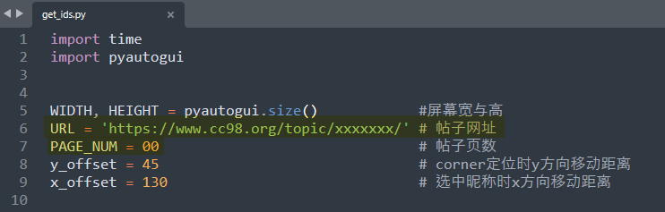
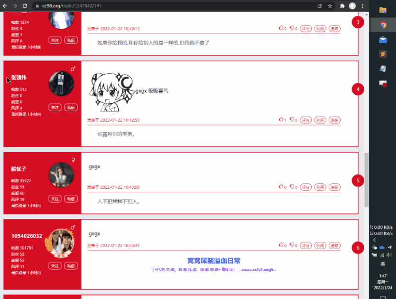
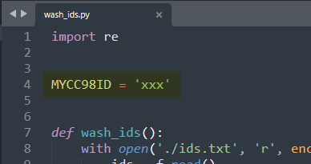
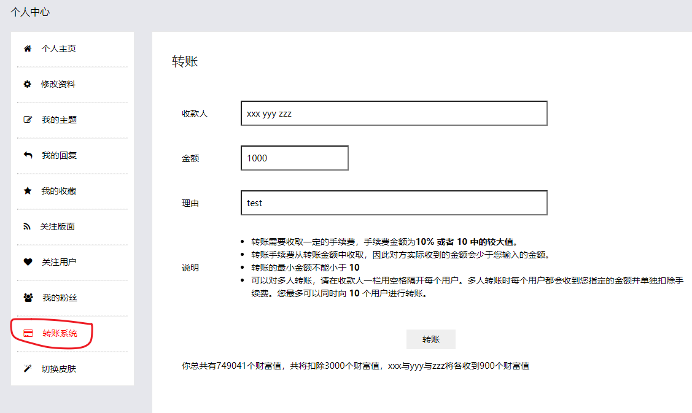

# cc98 capture ids

一个半自动的脚本，可在 CC98 论坛的指定主题下捕获所有参与评论的用户 ID，并作清洗和分组，用于批量转账赠米。

该脚本非网络爬虫，不违反论坛守则。

## Usage

1. 打开文本文件`ids.txt`，浏览器打开待捕获主题的页面

2. 在`/img`目录下重新截取自己环境下的对应截图，用于代码匹配定位

3. 打开`get_ids.py`并修改`URL`和`PAGE_NUM`参数到对应的主题

4. 运行`get_ids.py`，并在开始的前两秒迅速将屏幕切换到待捕获的主题，等待程序自动运行完毕

5. 程序运行完毕后，手动校对保存录入在`ids.txt`文件中的结果（偶尔会有偏差，将账号的帖数 、粉丝、威望、风评和最后登录时间也录入，手动删除即可）

6. 打开`wash_ids.py`，修改`MYCC98ID`为自己的 ID

7. 运行`list_ids.py`，得到经过清洗分组后的所有用户 ID（十人一组，已去重并去除本人 ID 及匿名用户）

8. 在网页端转账系统手动录入每一组用户 ID 并转账

## Attention

1. `/img`中的四张图片是作者环境下的截图，这些特征图片在其它电脑环境下大概率会发生变化，因此在新的电脑环境中运行前最好重新截图，截图尺寸不宜过大。

2. `get_ids.py`预留了两秒的时间将屏幕切换到浏览器页面，Windows 下可使用`Alt+Tab`快捷键快速切换；如果手速不够快，也可以在代码中手动修改休眠时间长度。

3. 作者要捕获的帖子基本都是短评论，因此屏幕中会显示一个以上的评论者。基于此，在`get_ids.py`中直接通过查找楼层间隙的位置来判断是否为本楼最后一个评论者。如果遇到长评论，导致屏幕中只显示一个楼层，该逻辑可能会失效，需进一步修改。

4. Python pyautogui 库模拟键鼠操作，实际使用时不够精确稳定，最常见的问题是在选中用户 ID 的同时偶尔也会捎带上后面无关的账户信息，因此要对跑出来的数据文件进行基本的人工校对。

## Background

作者有一篇论文接收的帖子上了当天的十大，按惯例想要给评论区回复的同学赠米，然而发现默认的赠米系统比较简陋，其中：

- 小程序中只能手动戳每个评论者单独发米

- 网页端可批量处理，每次最多同时发送十个人，通过空格区分 ID

首先排除小程序赠米，160多个人挨个点下来人都傻了。相对而言，网页端可以同时发送多人，稍微方便一些，但是需要复制粘贴每个人的账号，手动操作也是一件比较麻烦的事情。

因此，作者最先想到，可否写个爬虫把评论区所有 ID 爬下来。用 Python requests 库简单尝试了一下，发现并不可行，又版搜得知，原来 98 [已启用了反爬虫系统](https://www.cc98.org/topic/4918357/1#1)。使用更复杂的爬虫手段确实有可能成功突破系统防御，但是考虑到遵守论坛规则（以及自己才疏技拙），选择放弃继续尝试。最后打算用稍微笨一些的办法，使用 Python pyautogui 库编写自动化脚本模拟鼠标操作，用复制粘贴的方式将所有用户 ID 录下来。后续的数据清洗和分组就相对简单很多，不再赘述。

另外单独一提，最后采用手动复制粘贴的方式录入每组转账用户 ID，而不是编写自动化脚本，是因为 pyautogui 库模拟键盘操作不方便录入中英混杂的内容，模拟复制粘贴的行为也显得比较麻烦，考虑到只有十几组数据，手动的方式也可以接受，就偷个懒了。
